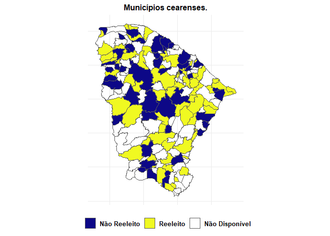
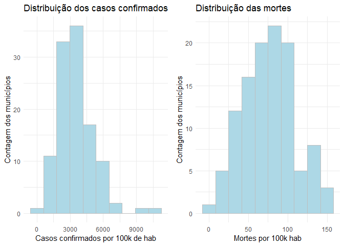

Municípios Cearenses que não reelegeram seus prefeitos tiveram mais
casos de covid19?
================
**Gerrio Barbosa**
11/05/2021

-   [Pacotes Usados](#pacotes-usados)
-   [Objetivo do Projeto](#objetivo-do-projeto)
-   [Análise Descritiva dos Dados](#análise-descritiva-dos-dados)
    -   [Análise Gráfica](#análise-gráfica)
-   [Análise do Modelo de Mínimos Quadrados Ordinários
    (MQO)](#análise-do-modelo-de-mínimos-quadrados-ordinários-mqo)
    -   [Regressão Simples](#regressão-simples)
    -   [Regressão Múltipla](#regressão-múltipla)
    -   [Tabela com as Estimações](#tabela-com-as-estimações)
-   [Conclusões](#conclusões)

<!-- README.md is generated from README.Rmd. Please edit that file -->

# Pacotes Usados

``` r
pacman::p_load('stats', 'tidyverse')
```

<!-- badges: start -->
<!-- badges: end -->

# Objetivo do Projeto

O projeto tem o objetivo de mostrar uma associação entre os casos
confirmados e mortes decorrentes da covid19 e o prefeito não ter sido
reeleito em 2020, ou seja, aqueles que estavam buscando um segundo
mandato. A hipótese noerteadora é que os municípios com prefeitos não
reeleitos foram aqueles com maior associação a quantidade de casos e
mortes notificadas durante a pandemia.

-   A primeira base de dados utilizada será a de casos confirmados e
    mortes relacionadas a pandemia da covid19, da plataforma
    [Brasil.IO](https://brasil.io/dataset/covid19/files/)

``` r
df_casos <- readr::read_rds('data/df_casosCE.rds')
```

-   A segunda base de dados uitlizada será a de candidaturas do
    [Tribunal Superios Eleitoral
    (TSE)](https://www.tse.jus.br/hotsites/pesquisas-eleitorais/candidatos.html),
    dos anos de 2016 e 2020, que possibilitam saber quais os prefeitos
    conseguiram a reeleição ou não.

``` r
df_casos <- readr::read_rds('data/df_naoReeleitoCE.rds')
```

-   Então será criado uma base de dados que concatenem essas duas bases
    anteriores, possibilitando que as variáveis de interesses estejam no
    mesmo `data.frame`.

``` r
df_casos <- readr::read_rds('data/dados.rds')
```

-   Os dados foram recortados somente para o estado do Ceará, com as
    variáveis de casos e mortes da covid19 sendo truncadas na data de
    `2020-12-31`, que mostram os quantitativos acumulados de todo ano
    de 2020. Por outro lado, a variável de reeleição é uma *dummy* (0 -
    quando o prefeito é reeleito e 1 - quando o prefeito não é
    reeleito). Portanto, além destas três variáveis principais citadas
    acima, a base `dados` possui mais sete variáveis:

    -   `c_uf`
    -   `codibge`
    -   `city`
    -   `pop19`
    -   `confirmed`
    -   `desths`
    -   `reeleicao`
    -   **`d_reeleicao`**
    -   **`confirmed_100k`**
    -   **`deaths_100k`**

-   O método que será utilizado para ver essa associação entre as
    variáveis será uma regressão simples de mínimos quadrados ordinários
    (MQO).

*y*<sub>*i*</sub> = *α* + *β**x* + *ϵ*

# Análise Descritiva dos Dados

-   Organizando a base de dados para realizar uma sumarização dos dados:

``` r
`%>%` <- magrittr::`%>%`
dados <- readr::read_rds('data/dados.rds') %>%
  dplyr::mutate(porte_cidade = dplyr::case_when(
    pop19 <= 10000 ~ 'Nivel 1',
    pop19 > 10000 & pop19 <= 30000 ~ 'Nivel 2',
    pop19 > 30000 & pop19 <= 60000 ~ 'Nivel 3',
    pop19 > 60000 & pop19 <= 200000 ~ 'Nivel 4',
    pop19 > 200000 ~ 'Nivel 5'
  )) %>%  dplyr::relocate(reeleicao:d_reeleicao, porte_cidade, .before = pop19)
```

-   Dados com coordenadas geográficas (retiradas do pacote do `geobr` do
    [Ipea](https://github.com/ipeaGIT/geobr)) dos municípios do estado
    do Ceará, as quais foram unidas a base `dados`:

``` r
mun <- readr::read_rds('data/dados_geom.rds')
```

-   Mapa mostrando os municípios que reelegeram seus prefeitos e os que
    não reelegeram.

    -   O Ceará tem 184 municípios, contudo, a amostra contempla somente
        os prefeitos de 2016 que conseguiram reeleeição ou não.
        Portanto, há outros 72 municípios que, por exemplo, os prefeitos
        já estavam em segundo mandato ou não buscaram a reeleição.

``` r

mun %>% ggplot2::ggplot(ggplot2::aes(fill = reeleicao))+
  ggplot2::geom_sf()+
  ggplot2::labs(title = 'Municípios cearenses.', fill = '')+
  ggplot2::theme_minimal()+
  ggplot2::scale_fill_viridis_d(option = "plasma",
                                labels = c("Não Reeleito", "Reeleito",
                                           "Não Disponível"))+
  ggplot2::theme(legend.position = 'bottom',
                 plot.title = ggplot2::element_text(hjust = 0.5, size = 12),
        text = ggplot2::element_text(family="Times New Roman", color="black",
                            size=12, face="bold"),
        axis.title=ggplot2::element_blank(),
        axis.text=ggplot2::element_blank(),
        axis.ticks=ggplot2::element_blank())+
  ggplot2::guides(ggplot2::guide_legend(title.position = 'none'))
```

<!-- -->

-   A tabela abaixo mostra quais as médias entre prefeitos reeleitos e
    não reeleitos, com uma estratificação pelo porte do município
    segundo sua faixa de população. Ao observar os valores médios das
    variáveis, constata-se um certo padrão no qual os municípios de
    menores e médio porte (até Nível 3) apresentam maiores médias no
    número de mortes por 100k de hab quando se trata de não reeleição
    dos prefeitos, enquanto os casos confirmados por 100k de hab parece
    seguir o padrão reverso quando observado do Nível 2 ao Nivel 4, onde
    os municípios que reelegeram seus prefeitos possuem maiores médias
    de casos confirmados. Diante disso, os indícios apontam que, talvez,
    no cenário de caos, os municípios que tiveram proporcionalmente mais
    casos da covid19 e conseguiram melhores desempenhos em relação a
    mitigar as perdas de vidas podem ter reelegido seus prefeitos como
    prêmio da peformance no período de crise. Por outro lado, quando se
    trata de cidades de grande porte (nessa amostra, cidades acima de
    200 mil habitantes), como Nível 5 por exemplo, em termos médios, os
    prefeitos foram reeleitos mesmo com maiores valores médios tanto
    para os casos confirmados por 100k de hab quanto das mortes por 100k
    de hab. Contudo, é preciso ter cautela nessa análise, pois a capital
    é um *outlier* quando se trata de pandemia, sendo que a média nem
    sempre representa uma medida confiável.

``` r
`%>%` <- magrittr::`%>%`
dados %>% 
  dplyr::select(reeleicao,porte_cidade, pop19, confirmed_100k, deaths_100k) %>% 
  dplyr::group_by(reeleicao,porte_cidade) %>%
  dplyr::summarise(dplyr::across(
    .cols = pop19:deaths_100k,
    .fns = ~ base::round(base::mean(.x, na.rm = T),2)
  ), .groups = 'drop') %>% knitr::kable(
    caption = '**Tabela 1.** Média das variáveis comparando os reeleitos e não reeleitos por porte da cidade.',
    align = 'c', col.names = c('Reeleiçao', 'Porte da Cidade', 'População', 
                               'Casos Confirmados por 100k de hab', 'Mortes por 100k de hab'),
    format.args = list(big.mark = '.', decimal.mark = ','))
```

|  Reeleiçao  | Porte da Cidade | População  | Casos Confirmados por 100k de hab | Mortes por 100k de hab |
|:-----------:|:---------------:|:----------:|:---------------------------------:|:----------------------:|
| naoReeleito |     Nivel 1     |  7.767,25  |             4.254,22              |         61,66          |
| naoReeleito |     Nivel 2     | 18.334,17  |             3.375,15              |         73,28          |
| naoReeleito |     Nivel 3     | 41.588,64  |             3.067,56              |         89,65          |
| naoReeleito |     Nivel 4     | 94.699,67  |             3.590,18              |         93,35          |
| naoReeleito |     Nivel 5     | 317.803,50 |             4.092,70              |         109,08         |
|  reeleito   |     Nivel 1     |  7.626,71  |             2.943,41              |         57,82          |
|  reeleito   |     Nivel 2     | 18.699,32  |             3.496,84              |         65,03          |
|  reeleito   |     Nivel 3     | 43.761,89  |             3.578,10              |         83,19          |
|  reeleito   |     Nivel 4     | 80.287,00  |             4.507,32              |         98,72          |
|  reeleito   |     Nivel 5     | 208.935,00 |             6.328,28              |         155,55         |

**Tabela 1.** Média das variáveis comparando os reeleitos e não
reeleitos por porte da cidade.

## Análise Gráfica

-   Analisar os histogramas para ter uma direção em relação a hipótese
    de normalidade, que deve ser garantida em estimações de mínimos
    quadrados ordinários. As variáveis usadas no histograma serão as
    variáveis dependentes dos modelos de regressões estimados
    posteriormente.

-   Fazer uma função simples para gerar os dois plots:

``` r
graf_hist <- function(base, indicador, titulo, eixo_x){
  `%>%` <- magrittr::`%>%`
  base %>%
    ggplot2::ggplot(ggplot2::aes(x = {{indicador}}))+
    ggplot2::geom_histogram(bins = 10, fill = 'lightblue', color = 'gray')+
    ggplot2::theme_minimal()+
    ggplot2::labs(title = titulo,
                  x = eixo_x,
                  y = 'Contagem dos municípios')
}
```

-   Agora, a função será usada:

``` r
d <- graf_hist(base=dados, indicador=confirmed_100k,
               titulo = 'Distribuição dos casos confirmados',
               eixo_x = 'Casos confirmados por 100k de hab')
d1 <- graf_hist(base=dados, indicador = deaths_100k,
                titulo = 'Distribuição das mortes',
                eixo_x = 'Mortes por 100k hab')

cowplot::plot_grid(d, d1)
```

<!-- -->

# Análise do Modelo de Mínimos Quadrados Ordinários (MQO)

## Regressão Simples

-   Serão usadas nas regressões as variáveis de casos confirmados e
    mortes por covid19 como variávies dependentes, enquanto a variável
    de interesse/explicativa será a reeleição do prefeito no ano
    de 2020. A hipótese levantada é que a não reeleição pode está
    associada ao mal desempenho dos prefeitos na condução da pandemia no
    ano de 2020.

    -   Será aplicado o `log` (logaritmo) nas variávies dependentes.

    -   A variável de reeleição é uma *dummy* (0 - reeleitos e 1 - não
        reeleitos), então, não será aplicado `log`.

    -   A forma funcional será uma *log-lin*.

    -   A interepretação será: uma aumento percentual na variável de
        reeleição (na chance de não se reeleger), aumenta ou diminui o
        percentual dos indicadores (casos de confirmados e mortes por
        covid19).

``` r
library(stats)

reg_1 <- lm(data =  dados, log(confirmed_100k) ~ d_reeleicao)
reg_2 <- lm(data =  dados, log(deaths_100k) ~ d_reeleicao)
```

## Regressão Múltipla

-   Para utilizar uma regressão múltipla com duas variáveis explicativas
    será feita uma ligação entre a base incial `dados` e a [base de
    mobilidade da google](https://www.google.com.br/covid19/mobility/).
    Contudo, devido os dados faltantes, principalmente para os
    municípios de pequeno porte, o resultado será uma amostra de 65
    municípios cearenses.

    -   Quando comparado a quantidade total de municípios do estado, a
        nova base terá cerca de 35% dos municípios.

    -   Quando comparado a amostra incial (que nesse caso específico
        seria a população dos prefeitos de 2016 que concorreram as
        eleições de 2020), a nova base fica com uma amostra que
        representa em torno de 58%.

-   O indicador de mobilidade usado na análise será o de **tendências de
    mobilidade de locais de trabalho**.

``` r
`%>%` <- magrittr::`%>%`
mob <- readr::read_rds('data-raw/mob_google_mun.RDS') %>%
  dplyr::filter(sigla_uf == 'CE') %>%
  dplyr::select(cod_municipio7, indice_mob = localTrab) %>%
  dplyr::left_join(dados, by = c('cod_municipio7'='codibge')) %>%
  tidyr::drop_na(deaths_100k)
```

``` r
library(stats)

reg_m_1 <- lm(data =  mob, log(confirmed_100k) ~ d_reeleicao + indice_mob)
reg_m_2 <- lm(data =  mob, log(deaths_100k) ~ d_reeleicao + indice_mob)
```

## Tabela com as Estimações

-   Na tabela abaixo serão apresentadas todas as estimações simples e
    múltiplas.

``` r
stargazer::stargazer(reg_1, reg_2, reg_m_1, reg_m_2, type = 'text',
                     title = "Regressões de Mínimos Quadrados Ordninários.",
                     dep.var.caption = 'Variável Dependente',
                      omit.table.layout = c('n'),
                     omit.stat=c("LL","ser","f")
                     )
#> 
#> Regressões de Mínimos Quadrados Ordninários.
#> ======================================================================================
#>                                         Variável Dependente                           
#>              -------------------------------------------------------------------------
#>              log(confirmed_100k) log(deaths_100k) log(confirmed_100k) log(deaths_100k)
#>                      (1)               (2)                (3)               (4)       
#> --------------------------------------------------------------------------------------
#> d_reeleicao        -0.037             0.087             -0.187             0.080      
#>                    (0.096)           (0.106)            (0.120)           (0.102)     
#>                                                                                       
#> indice_mob                                              -0.015            -0.018*     
#>                                                         (0.012)           (0.010)     
#>                                                                                       
#> Constant          8.082***           4.181***          7.997***           4.101***    
#>                    (0.062)           (0.069)            (0.173)           (0.147)     
#>                                                                                       
#> --------------------------------------------------------------------------------------
#> Observations         112               112                65                 65       
#> R2                  0.001             0.006              0.068             0.050      
#> Adjusted R2        -0.008             -0.003             0.038             0.019      
#> ======================================================================================
```

-   Observando os resultados da tabela, pode-se notar que a variável de
    interesse (`não reeleitos`) não tem relação com as variáveis
    dependentes (`casos confirmados`, `mortes`). Portanto, de acordo com
    o esboço apresentado, a não reeleição dos prefeitos dos municípios
    cearenses não está relacionada com o fato do agravamento ou não da
    pandemia, que foram mensurados por meio dos indicadores de casos
    confirmados e mortes por covid19. Mesmo quando inserida uma variável
    de controle (`indice de mobilidade`), ainda assim, esse resultado se
    mantém.

# Conclusões

O esboço buscou responder se os prefeitos cearenses não foram reeleitos
devido a má gestão da crise pandemica da covid19. Para isso, usou-se a
metodologia de MQO. Contudo, os resultados apontaram que há relação
entre o prefeito não ser reeleito com o mal desempenho na gerência da
pandemia.

    - Vale ressaltar que este esboço é bastante superficial e, portanto, tem diversas limitações. 
    - Outro ponto a ser ressaltado é que esse esboço é somente para uma unidade da federação, sendo possível que os resultados pra outras unidades possam ser diferentes.
