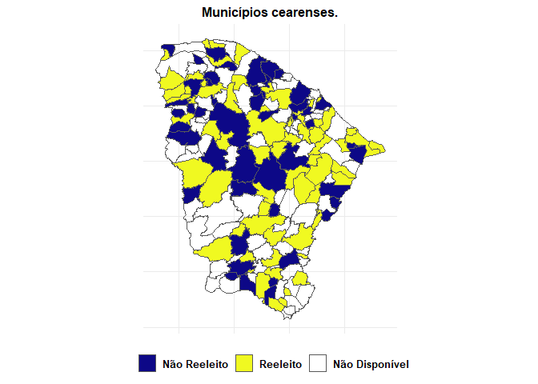

Municípios Cearenses que não reelegeram seus prefeitos tiveram mais
casos de covid19?
================
**Gerrio Barbosa**
10/05/2021

-   [Análise Descritiva dos Dados](#análise-descritiva-dos-dados)
    -   [Análise Gráfica](#análise-gráfica)
    -   [Conclusões](#conclusões)

<!-- README.md is generated from README.Rmd. Please edit that file -->
<!-- badges: start -->
<!-- badges: end -->

O projeto tem o objetivo de mostrar uma associação entre os casos
confirmados e mortes decorrentes da covid19 e o prefeito não ter sido
reeleito em 2020, ou seja, aqueles que estavam buscando um segundo
mandato. A hipótese noerteadora é que os municípios com prefeitos não
reeleitos foram aqueles com maior associação a quantidade de casos e
mortes notificadas durante a pandemia.

-   A primeira base de dados utilizada será a de casos confirmados e
    mortes relacionadas a pandemia da covid19, da plataforma
    [Brasil.IO](https://brasil.io/dataset/covid19/files/)

``` r
df_casos <- readr::read_rds('data/df_casosCE.rds')
```

-   A segunda base de dados uitlizada será a de candidaturas do
    [Tribunal Superios Eleitoral
    (TSE)](https://www.tse.jus.br/hotsites/pesquisas-eleitorais/candidatos.html),
    dos anos de 2016 e 2020, as quais possibitam saber os prefeitos que
    conseguiram a reeleição ou não.

``` r
df_casos <- readr::read_rds('data/df_naoReeleitoCE.rds')
```

-   Então vamos criar uma base de dados que junte essas duas bases
    anteriores, possibilitando que as variáveis de interesses estejam no
    mesmo `data.frame`.

``` r
df_casos <- readr::read_rds('data/dados.rds')
```

-   Os dados foram recortados somente para o estado do Ceará, com as
    variáveis de casos e mortes da covid19 sendo truncadas na data de
    `2020-12-31`, que mostra os quantitativos acumulados de todo ano
    de 2020. Por outro lado, a variável de reeleição é uma *dummy*.
    Portanto, além destas três variáveis principais citadas acima, a
    base `dados` possui mais sete variáveis:

    -   `c_uf`
    -   `codibge`
    -   `city`
    -   `pop19`
    -   `confirmed`
    -   `desths`
    -   `reeleicao`
    -   **`d_reeleicao`**
    -   **`confirmed_100k`**
    -   **`deaths_100k`**

-   O método que será utilizado para ver essa associação entre as
    variáveis será uma regressão simples de mínimos quadrados ordinários
    (MQO). *y*<sub>*i*</sub> = *α* + *β**x* + *ϵ*

# Análise Descritiva dos Dados

-   Organizando a base de dados para realizar uma sumarização dos dados.

``` r
`%>%` <- magrittr::`%>%`
dados <- readr::read_rds('data/dados.rds') %>%
  dplyr::mutate(porte_cidade = dplyr::case_when(
    pop19 <= 10000 ~ 'Nivel 1',
    pop19 > 10000 & pop19 <= 30000 ~ 'Nivel 2',
    pop19 > 30000 & pop19 <= 60000 ~ 'Nivel 3',
    pop19 > 60000 & pop19 <= 200000 ~ 'Nivel 4',
    pop19 > 200000 ~ 'Nivel 5'
  )) %>%  dplyr::relocate(reeleicao:d_reeleicao, porte_cidade, .before = pop19)
```

-   Dados geográficos (`geobr`) com as coordenadas dos limtes dos
    municípios do estado do Ceará para juntar a base de `dados` com as
    variáveis principais:

``` r
mun <- geobr::read_municipality(code_muni = 'CE') %>%
  dplyr::select(code_muni, geom) %>%
  dplyr::left_join(dados, by = c('code_muni'='codibge'))
#> Downloading: 1.2 kB     Downloading: 1.2 kB     Downloading: 2 kB     Downloading: 2 kB     Downloading: 10 kB     Downloading: 10 kB     Downloading: 26 kB     Downloading: 26 kB     Downloading: 43 kB     Downloading: 43 kB     Downloading: 59 kB     Downloading: 59 kB     Downloading: 67 kB     Downloading: 67 kB     Downloading: 83 kB     Downloading: 83 kB     Downloading: 99 kB     Downloading: 99 kB     Downloading: 120 kB     Downloading: 120 kB     Downloading: 120 kB     Downloading: 120 kB     Downloading: 120 kB     Downloading: 120 kB     Downloading: 140 kB     Downloading: 140 kB     Downloading: 160 kB     Downloading: 160 kB     Downloading: 170 kB     Downloading: 170 kB     Downloading: 190 kB     Downloading: 190 kB     Downloading: 200 kB     Downloading: 200 kB     Downloading: 220 kB     Downloading: 220 kB     Downloading: 240 kB     Downloading: 240 kB     Downloading: 240 kB     Downloading: 240 kB     Downloading: 240 kB     Downloading: 240 kB     Downloading: 260 kB     Downloading: 260 kB     Downloading: 270 kB     Downloading: 270 kB     Downloading: 280 kB     Downloading: 280 kB     Downloading: 290 kB     Downloading: 290 kB     Downloading: 300 kB     Downloading: 300 kB     Downloading: 320 kB     Downloading: 320 kB     Downloading: 330 kB     Downloading: 330 kB     Downloading: 350 kB     Downloading: 350 kB     Downloading: 360 kB     Downloading: 360 kB     Downloading: 370 kB     Downloading: 370 kB     Downloading: 370 kB     Downloading: 370 kB
```

-   Mapa mostrando os municípios que reelegeram seus prefeitos e os que
    não reelegeram.
    -   O Ceará tem 184 municípios, contudo, a amostra contempla somente
        os prefeitos de 2016 que conseguiram reeleeição ou não.
        Portanto, há outros 72 municípios que nos quais, por exemplo, os
        prefeitos já estavam em segundo mandato ou não buscaram a
        reeleição.

``` r

mun %>% ggplot2::ggplot(ggplot2::aes(fill = reeleicao))+
  ggplot2::geom_sf()+
  ggplot2::labs(title = 'Municípios cearenses.', fill = '')+
  ggplot2::theme_minimal()+
  ggplot2::scale_fill_viridis_d(option = "plasma",
                                labels = c("Não Reeleito", "Reeleito",
                                           "Não Disponível"))+
  ggplot2::theme(legend.position = 'bottom',
                 plot.title = ggplot2::element_text(hjust = 0.5, size = 12),
        text = ggplot2::element_text(family="Times New Roman", color="black",
                            size=12, face="bold"),
        axis.title=ggplot2::element_blank(),
        axis.text=ggplot2::element_blank(),
        axis.ticks=ggplot2::element_blank())+
  ggplot2::guides(ggplot2::guide_legend(title.position = 'none'))
```

<!-- -->

-   A tabela abaixo mostra quais as médias entre prefeitos reeleitos e
    não reeleitos, com uma estratificação pelo porte do município
    segundo sua faixa de população. Ao observar os valores médios das
    variáveis, constata-se um certo padrão no qual os municípios de
    menores e médio porte (até Nível 3) apresentam maiores médias no
    número de mortes por 100k de hab quando se trata de não reelição dos
    prefeitos, enquanto os casos confirmados por 100k de hab parece
    seguir o padrão reverso quando observado do Nível 2 ao Nivel 4, onde
    os municípios que reelegeram seus prefeitos possuem maiores médias
    de casos confirmados. Diante disso, os indícios apontam que, talvez,
    no cenário de caos, os municípios que tiveram proporcionalmente mais
    casos da covid19 e conseguiram melhores desempenhos em relação a
    mitigar a perdas de vidas podem ter sido reelegido como prêmio da
    pefromance no período de crise. Por outro lado, quando se trata de
    cidades de grande porte (nessa amostra, cidades acima de 200 mil
    habitantes), como Nível 5 por exemplo, em termos médios, os
    prefeitos foram reeleitos mesmo com maiores valores médios tanto
    para os casos confirmados quanto das mortes por 100k de hab.
    Contudo, é preciso ter cautela nessa análise, pois a capital é um
    *outlier* quando se trata de pandemia, sendo que a média nem sempre
    repsresenta uma medida confiável.

``` r
`%>%` <- magrittr::`%>%`
dados %>% 
  dplyr::select(reeleicao,porte_cidade, pop19, confirmed_100k, deaths_100k) %>% 
  dplyr::group_by(reeleicao,porte_cidade) %>%
  dplyr::summarise(dplyr::across(
    .cols = pop19:deaths_100k,
    .fns = ~ base::round(base::mean(.x, na.rm = T),2)
  ), .groups = 'drop') %>% knitr::kable(
    caption = '**Tabela 1.** Média das variáveis comparando os reeleitos e não reeleitos por porte da cidade.',
    align = 'c', col.names = c('Reeleiçao', 'Porte da Cidade', 'População', 
                               'Casos Confirmados por 100k de hab', 'Mortes por 100k de hab'),
    format.args = list(big.mark = '.', decimal.mark = ','))
```

|  Reeleiçao  | Porte da Cidade | População  | Casos Confirmados por 100k de hab | Mortes por 100k de hab |
|:-----------:|:---------------:|:----------:|:---------------------------------:|:----------------------:|
| naoReeleito |     Nivel 1     |  7.767,25  |             4.254,22              |         61,66          |
| naoReeleito |     Nivel 2     | 18.334,17  |             3.375,15              |         73,28          |
| naoReeleito |     Nivel 3     | 41.588,64  |             3.067,56              |         89,65          |
| naoReeleito |     Nivel 4     | 94.699,67  |             3.590,18              |         93,35          |
| naoReeleito |     Nivel 5     | 317.803,50 |             4.092,70              |         109,08         |
|  reeleito   |     Nivel 1     |  7.626,71  |             2.943,41              |         57,82          |
|  reeleito   |     Nivel 2     | 18.699,32  |             3.496,84              |         65,03          |
|  reeleito   |     Nivel 3     | 43.761,89  |             3.578,10              |         83,19          |
|  reeleito   |     Nivel 4     | 80.287,00  |             4.507,32              |         98,72          |
|  reeleito   |     Nivel 5     | 208.935,00 |             6.328,28              |         155,55         |

**Tabela 1.** Média das variáveis comparando os reeleitos e não
reeleitos por porte da cidade.

## Análise Gráfica

## Conclusões
